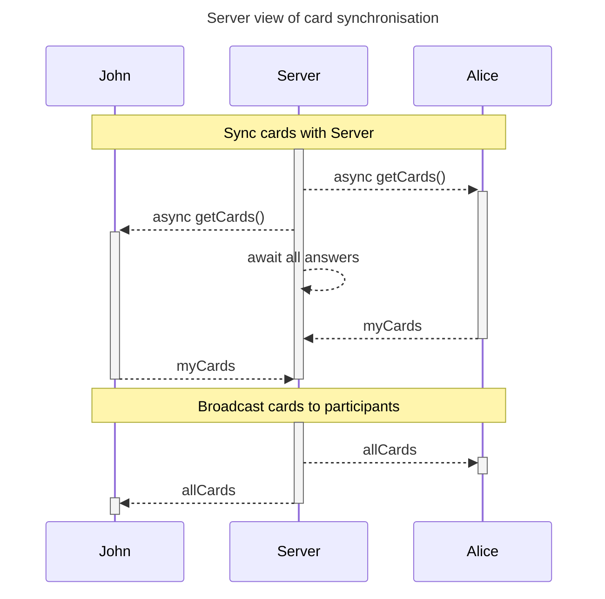
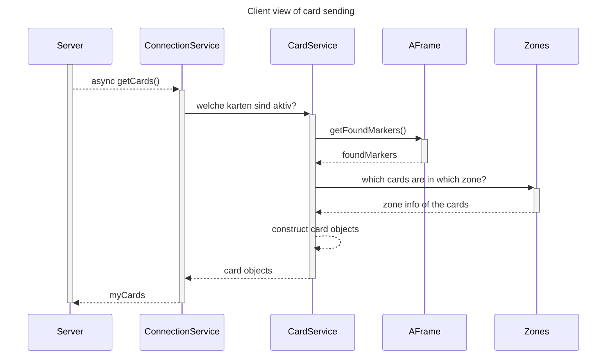
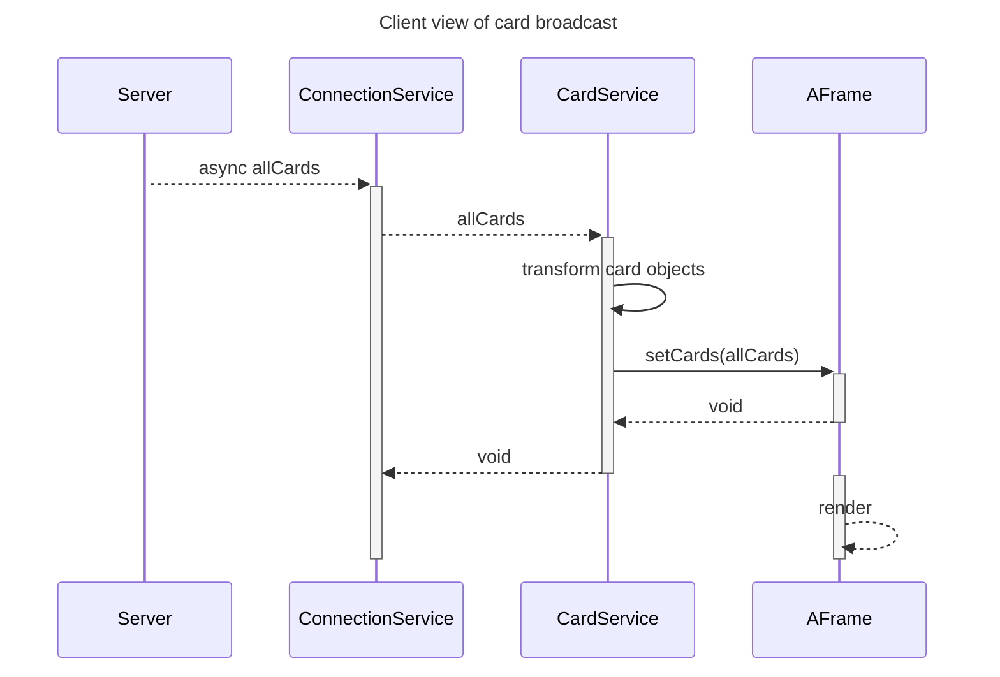

# Links:
[Live Page](https://yuru-baku.github.io/InfintyDeck/)
[Kanban](https://miro.com/welcomeonboard/Y0pHWlpaUjEwR0RYSjBvZjFmMDYwcXRKRVhmY2M2a2FKY0ZJdFRvOU1qM01qVTUyRzdkbHVJTnc4TmhZa0RJQ3wzNDU4NzY0NTc0NzE4Mzk3MjYyfDI=?share_link_id=690598034590)

# Syncing Cards

