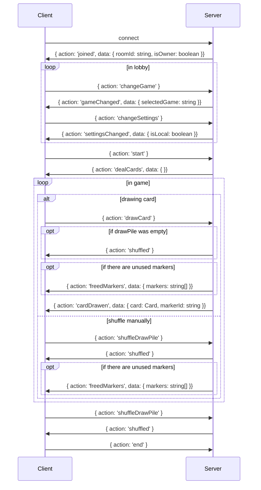

# The Backend
## Setup
To start this project you will need to have node.js with a version over 20.0.0 installed.
With that run 
```bash
npm install
npm run build
npm run start
```
or use `npm run dev` to start developing.
In any case you will need a running MongoDB instance somewhere.
For example you can pull a docker image:
```bash
docker pull mongodb/mongodb-community-server
sudo docker run --name infinity_deck -d -p 27017:27017 mongodb/mongodb-community-server:latest
```
If you want to use another instance, you will need to update the [`.env`-file](./.env).

## Communication

