```
docker pull mongodb/mongodb-community-server
sudo docker run --name infinity_deck -d -p 27017:27017 mongodb/mongodb-community-server:latest
```


Offene Fragen: 
- Wie beeenden wir das Spiel? Entscheiden das die Nutzer?

```mermaid
sequenceDiagram
participant C as Client
participant S as Server

C->>S: connect
S->>C: { action: 'joined', data: { roomId: string, isOwner: boolean }}

C->>S: { action: 'start' }
S->>C: { action: 'dealCards', data: { handCards: string[] }}

loop one turn
  S->>C: { action: 'yourTurn', data: { nextActions: string[] }}
  alt drawing card
    C->>S: { action: 'drawCard' }
    opt if drawPile was empty
      S->>C: { action: 'shuffled' }
    end
    S->>C: { action: 'drawCard', data: { newCard: string, handCards: string[], nextActions: string[] }}
    alt endTurn
      C->>S: { action: 'endTurn' }
      S->>C: { action: 'endTurn' }}
    else playCard
      C->>S: { action: 'playCard' }
      S->>C: { action: 'playCard', data: { newCard: string, handCards: string[], nextActions: string[] }}
    end
    C->>S: { action: 'playCard' }
    S->>C: { action: 'playCard', data: { newCard: string, handCards: string[], nextActions: string[] }}
  end
end

C->>S: { action: 'shuffleDrawPile' }
S->>C: { action: 'shuffled' }
C->>S: { action: 'end' }
```



